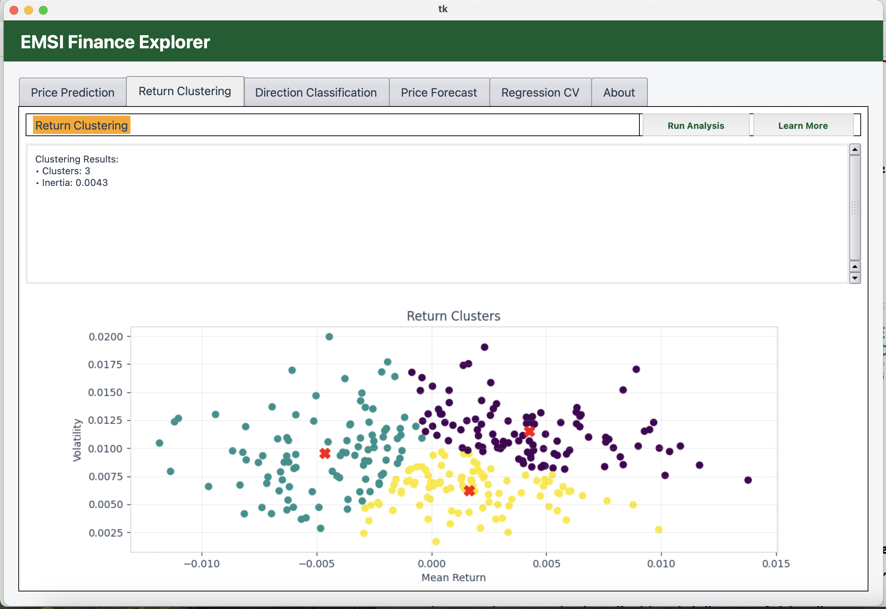

# 🧠 EMSI Finance Explorer – AI Algo Visualizer

An advanced desktop application for exploring and visualizing key financial algorithms using modern machine learning techniques and a sleek user interface.

---

## 🌟 Overview

**EMSI Finance Explorer** allows students and professionals to experiment with core AI models applied to financial data simulations.

### 🔍 Key Features:
- 📈 **Price Prediction** using Linear Regression
- 🎯 **Direction Classification** using Random Forest
- 📊 **Return Clustering** using K-Means
- 📉 **Time Series Forecasting** using ARIMA
- 🔁 **Regression Cross-Validation** using KFold strategy
- 🎨 Modern UI with EMSI-themed styling (custom palette, hover buttons, cards)

---

## 🛠 Technologies Used

- **Language**: Python 3.x
- **Libraries**: `numpy`, `pandas`, `matplotlib`, `scikit-learn`, `statsmodels`, `Pillow`
- **Interface**: Tkinter + `ttkthemes`
- **Packaging**: PyInstaller for `.exe` or `.app`

---

## 🚀 Getting Started

### ✅ Prerequisites
- Python ≥ 3.8
- pip (Python package installer)

### ⚙️ Installation

```bash
git clone https://github.com/G-Zak/IA_Algo_V3.git
cd IA_Algo_V3
pip install -r requirements.txt
```

### ▶️ Usage

```bash
python main.py
```

### 💾 To build as an executable (Windows or macOS):

```bash
pyinstaller --onefile --noconsole main.py
```

Output is located in the `dist/` folder.

---

## 📂 Project Structure

```
IA_Algo_V3/
├── main.py             # Main interface logic
├── algorithms.py       # Tabs with each algorithm
├── style.py            # Color palette and UI components
├── emsiLogo.png        # EMSI branding
├── requirements.txt    # Required dependencies
├── assets/             # Screenshots and icons
└── README.md
```

---

## 📸 Interface Preview



---

## 👨‍💻 Author

**Zakaria Guennani**  
🎓 EMSI – 3rd year engineering student  
📧 guennanizakaria69@gmail.com  
🌐 [github.com/G-Zak](https://github.com/G-Zak)  
👩‍🏫 Supervisor: Dr. Mouna El Mkhalet

---

## 📜 License

MIT License – Free to use with attribution.

---

# 🇫🇷 EMSI Finance Explorer – Visualiseur IA

---

## 🌟 Présentation

Une application interactive développée pour explorer les algorithmes d’intelligence artificielle appliqués à la finance, dans un cadre pédagogique stylisé et moderne.

### 🎯 Fonctionnalités :
- 📈 **Prédiction des prix** via régression linéaire
- 🎯 **Classification des tendances** avec Random Forest
- 📊 **Clustering des rendements** (K-Means)
- 📉 **Prévisions temporelles** (ARIMA)
- 🔁 **Validation croisée** (KFold)
- 🖥 Interface graphique personnalisée (charte EMSI)

---

## 🛠 Technologies

- **Langage** : Python 3.x
- **Librairies** : `numpy`, `pandas`, `matplotlib`, `scikit-learn`, `statsmodels`, `Pillow`
- **Interface** : Tkinter avec `ttkthemes`
- **Export** : PyInstaller pour `.exe` / `.app`

---

## 🚀 Lancement

### ✅ Pré-requis

- Python ≥ 3.8  
- pip installé

### ⚙️ Installation

```bash
git clone https://github.com/G-Zak/IA_Algo_V3.git
cd IA_Algo_V3
pip install -r requirements.txt
```

### ▶️ Utilisation

```bash
python main.py
```

### 💾 Générer un exécutable :

```bash
pyinstaller --onefile --noconsole main.py
```

---

## 📂 Structure

```
IA_Algo_V3/
├── main.py             # Logique principale
├── algorithms.py       # Algorithmes IA
├── style.py            # Style visuel EMSI
├── emsiLogo.png        # Logo EMSI
├── requirements.txt
├── assets/
└── README.md
```

---

## 👨‍💻 Auteur

**Zakaria Guennani**  
🎓 Étudiant EMSI – 3e année  
📧 guennanizakaria69@gmail.com  
🌐 [github.com/G-Zak](https://github.com/G-Zak)  
👩‍🏫 Encadrante : Dr. Mouna El Mkhalet

---

## 📜 Licence

Projet sous **Licence MIT** – réutilisation libre avec attribution.
